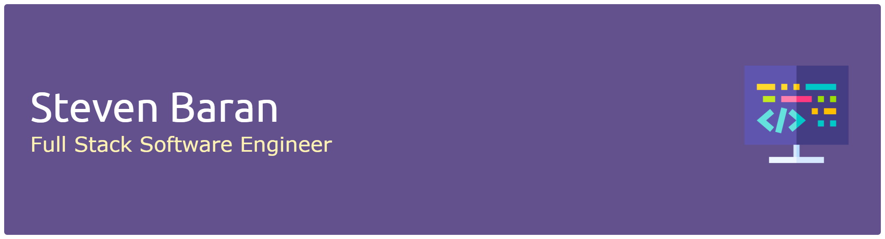

# 💫 About Me:
Steven Baran is a Full Stack Software Engineer specializing in algorithmic design and server architecture. His interests and expertise include (but are not limited to) statistical aggregation,  data structures, and early/late stage startups. 

## 🌐 Socials:
   

# 💻 Tech Stack:
                                                                                    

